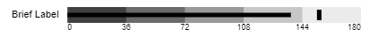
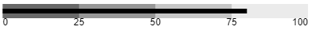
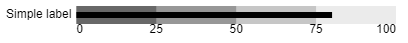
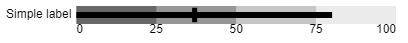
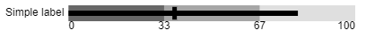
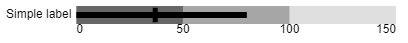
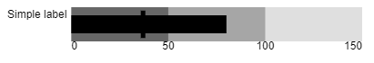
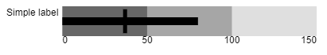
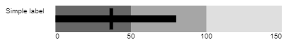

# bullet-p5js
Create a bullet graph, based on [Stephen Few's spec](http://www.perceptualedge.com/articles/misc/Bullet_Graph_Design_Spec.pdf)

## Example Graphs


## Built With
* [P5.js](https://p5js.org)

## Features

* URL parameter-driven display
* Simple installation (one js file, `bullet.js`)
* Easy to use - most values have reasonable defaults

## Usage
* Download `bullet.js`
* Create a simple P5.js page (`index.html` is provided as an example)
* Serve the `index.html` from a standard web server (local or remote) [n.b. opening it as a local file also works]
* Open the `index.html`
* Pass in parameters to configure the graph
  * __Required__
    * *val*: Bar's value (no default)
  * __Optional__
    * *label*: Text label (default: empty string)
    * *max*: Maximum value of the graph (default: 100)
    * *bins*: Number of quantitative groups (default: 4)
    * *width*: Width (in pixels) of the entire canvas (in pixels; default: 400)
    * *height*: Height (in pixels) of the canvas (in pixels; default: 30)
    * *barHeight*: Value bar height (in pixels; default: 20)
    * *fontSize*: Label font size (default: 12)
    * *cross*: Cross-bar value (not displayed by default)

Note: All defaults are defined at the top of `bullet.js`

## Example
Example URLs and graphs

### **Value** (here: 80; _N.B. this is the only required setting_)

* file:///C:/path/to/local/copy/of/bullet-p5js/index.html?val=80
* http://localhost:9000/index.html?max=180&val=137&bins=5&label=Brief%20Label&cross=153

### **Custom label** (here: 'Simple label'; default: no label)


* file:///C:/path/to/local/copy/of/bullet-p5js/index.html?val=80&label=Simple%20label
* http://localhost:9000/index.html?val=80&label=Simple%20label

### **Crossbar** (here: at 37; default: no crossbar)

* file:///C:/path/to/local/copy/of/bullet-p5js/index.html?val=80&label=Simple%20label&cross=37
* http://localhost:9000/index.html?val=80&label=Simple%20label&cross=37

### **Custom bin count** (here: 3; default: 4)


* file:///C:/path/to/local/copy/of/bullet-p5js/index.html?val=80&label=Simple%20label&cross=37&bins=3
* http://localhost:9000/index.html?val=80&label=Simple%20label&cross=37&bins=3

### **Custom maximum value** (here: 150; default: 100)


* file:///C:/path/to/local/copy/of/bullet-p5js/index.html?val=80&label=Simple%20label&cross=37&bins=3&max=150
* http://localhost:9000/index.html?val=80&label=Simple%20label&cross=37&bins=3&max=150

### **Custom canvas height** (here: 50; default: 30)


* file:///C:/path/to/local/copy/of/bullet-p5js/index.html?val=80&label=Simple%20label&cross=37&bins=3&max=150&height=50
* http://localhost:9000/index.html?val=80&label=Simple%20label&cross=37&bins=3&max=150&height=50

### **Custom bar height** (here: 10; default: 20)


* file:///C:/path/to/local/copy/of/bullet-p5js/index.html?val=80&label=Simple%20label&cross=37&bins=3&max=150&height=50&barHeight=10
* http://localhost:9000/index.html?val=80&label=Simple%20label&cross=37&bins=3&max=150&height=50&barHeight=10

### **Custom font size** (here: 10; default: 12)


* file:///C:/path/to/local/copy/of/bullet-p5js/index.html?val=80&label=Simple%20label&cross=37&bins=3&max=150&height=50&barHeight=10&fontSize=10
* http://localhost:9000/index.html?val=80&label=Simple%20label&cross=37&bins=3&max=150&height=50&barHeight=10&fontSize=10


## Hacking
* Clone the repo
```sh
git clone https://github.com/balain/bullet-p5js
```

### Prerequisites

None. ([P5.js](https://p5js.org) is loaded from the index.html file)

## Contributing

Contributions are what make the open source community such an amazing place to be learn, inspire, and create. Any contributions you make are **greatly appreciated**.

1. Fork the Project
2. Create your Feature Branch (`git checkout -b feature/AmazingFeature`)
3. Commit your Changes (`git commit -m 'Add some AmazingFeature'`)
4. Push to the Branch (`git push origin feature/AmazingFeature`)
5. Open a Pull Request

## License

Distributed under the MIT License. See `LICENSE` for more information.

## Contact

Project Link: [https://github.com/balain/bullet-p5js](https://github.com/balain/bullet-p5js)

## Acknowledgements
* [README Template from https://github.com/othneildrew/Best-README-Template](https://github.com/othneildrew/Best-README-Template)
* [Bullet Graph spec: http://www.perceptualedge.com/articles/misc/Bullet_Graph_Design_Spec.pdf](http://www.perceptualedge.com/articles/misc/Bullet_Graph_Design_Spec.pdf)