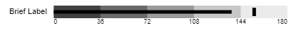

# bullet-p5js
Create a bullet chart, based on [Stephen Few's spec: http://www.perceptualedge.com/articles/misc/Bullet_Graph_Design_Spec.pdf](http://www.perceptualedge.com/articles/misc/Bullet_Graph_Design_Spec.pdf)

## About The Project

bullet-p5js



### Built With
* [P5js](https://p5js.org)

## Getting Started

* Clone the repo
```sh
git clone https://github.com/balain/bullet-p5js
```
* Serve the `index.html` from a standard web server (local or remote) [n.b. opening it as a local file also works]
* Open the `index.html`
* Pass in parameters to configure the chart [*all are optional*]
  * *label*: Text label (default: empty)
  * *max*: Maximum value of the chart (default: 100)
  * *val*: Bar's value (default: 50)
  * *bins*: Number of quantitative groups (default: 4)
  * *width*: Width (in pixels) of the entire canvas (in pixels; default: 400)
  * *height*: Height (in pixels) of the canvas (in pixels; default: 30)
  * *barHeight*: Value bar height (in pixels; default: 20)
  * *fontSize*: Label font size (default: 12)
  * *cross*: Cross-bar value (not displayed by default)

### Prerequisites

None. (P5.js is loaded from the index.html file)

## Usage

Both URLs below will both generate this same chart:


* file:///C:/path/to/local/copy/of/bullet-p5js/index.html?max=180&val=137&bins=5&label=Brief%20Label&cross=153

* http://localhost:9000/index.html?max=180&val=137&bins=5&label=Brief%20Label&cross=153

## Contributing

Contributions are what make the open source community such an amazing place to be learn, inspire, and create. Any contributions you make are **greatly appreciated**.

1. Fork the Project
2. Create your Feature Branch (`git checkout -b feature/AmazingFeature`)
3. Commit your Changes (`git commit -m 'Add some AmazingFeature'`)
4. Push to the Branch (`git push origin feature/AmazingFeature`)
5. Open a Pull Request

## License

Distributed under the MIT License. See `LICENSE` for more information.

## Contact

Project Link: [https://github.com/balain/bullet-p5js](https://github.com/balain/bullet-p5js)

## Acknowledgements
* [README Template from https://github.com/othneildrew/Best-README-Template](https://github.com/othneildrew/Best-README-Template)
